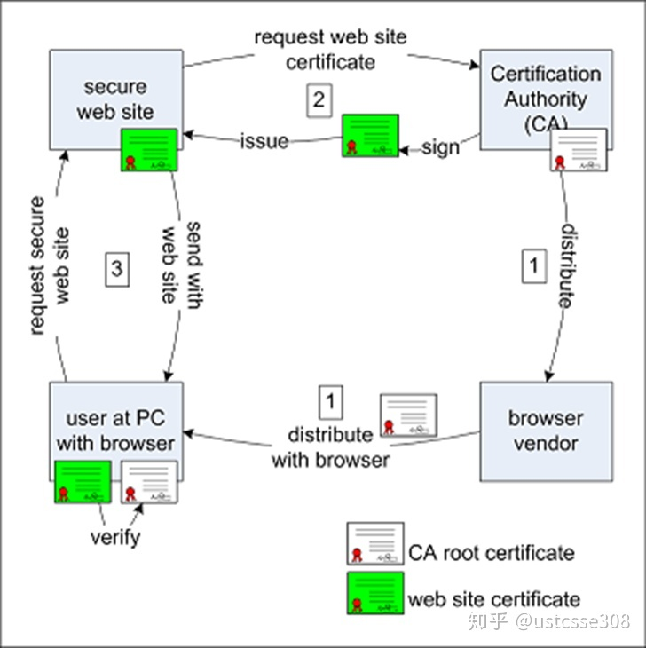

# 信息安全 HTTPS

### HTTPS介绍
> HTTPS（全称：Hyper Text Transfer Protocol over Secure Socket Layer），是以安全为目标的HTTP通道，简单讲是HTTP的安全版。即HTTP下加入SSL层，HTTPS的安全基础是SSL，因此加密的详细内容就需要SSL。  
HTTP协议以明文方式发送内容，不提供任何方式的数据加密，如果攻击者截取了Web浏览器和网站服务器之间的传输报文，就可以直接读懂其中的信息，因此HTTP协议不适合传输一些敏感信息，比如信用卡号、密码等。  
为了解决HTTP协议的这一缺陷，需要使用另一种协议：安全套接字层超文本传输协议HTTPS。为了数据传输的安全，HTTPS在HTTP的基础上加入了SSL协议，SSL依靠证书来验证服务器的身份，并为浏览器和服务器之间的通信加密。

> HTTPS和HTTP的区别主要为以下四点：
>- https协议需要到ca申请证书，一般免费证书很少，需要交费。
>- http是超文本传输协议，信息是明文传输，https 则是具有安全性的ssl加密传输协议。
>- http和https使用的是完全不同的连接方式，用的端口也不一样，前者是80，后者是443。
-> http的连接很简单，是无状态的；HTTPS协议是由SSL+HTTP协议构建的可进行加密传输、身份认证的网络协议，比http协议安全。

### HTTPS 搭建

下图展示了HTTPS建立的流程.

下面介绍一下这个流程：

- CA建立,并颁发给自己根证书.即CA使用自己的私钥,将CA的验证信息与自己的公钥打包成根证书.
- 浏览器将CA根证书添加进浏览器
- 网站服务器将自己的验证信息与公钥发给CA,申请网站的证书.CA在验证这个网站合法性之后,会用CA自己的私钥对网站的验证信息和公钥打包加密,形成这个网站的证书,并颁发给网站.
- 网站搭建自己的https服务

### HTTPS 握手

客户端要使用网站的https服务,网站会将自己的证书发送给用户,用户浏览器使用CA的证书对网站证书进行验证,核实无误后建立安全链接,这个过程就是SSL握手过程.
- 用户浏览器发送SSL版本以及加密和压缩算法给服务器.服务器检查是否支持次版本SSL,并启动客户端期望的加密和压缩算法.
- 基础配置完毕后,服务器发送自己的证书.该证书必须被用户服务器或CA所信任.
- 用户使用验证证书,并核实服务器的身份是正确的.
- 验证完毕后,两者通过`非对称加密`方式来协商之后的对称加密方式,然后用户通过协商好的加密方式发送一个验证消息给服务器.
- 服务器验证"消息"是用户发送的,并且可以被解密.服务器将解密后的"消息"发送给用户.用户核实后建立安全链接.

建立安全链接以后通过`对称加密`方式交流,因为对称加密方式占用资源更少.