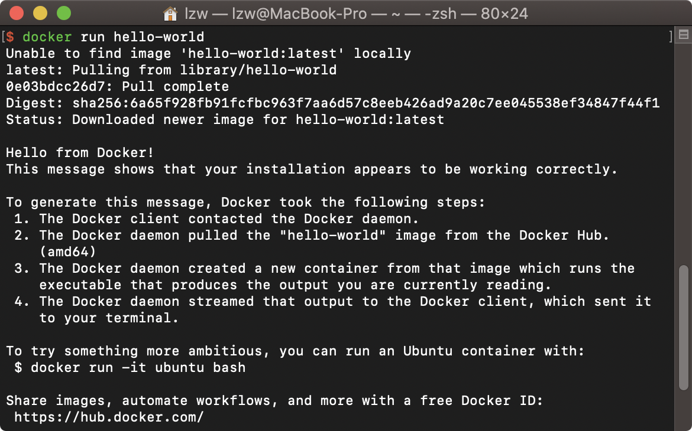
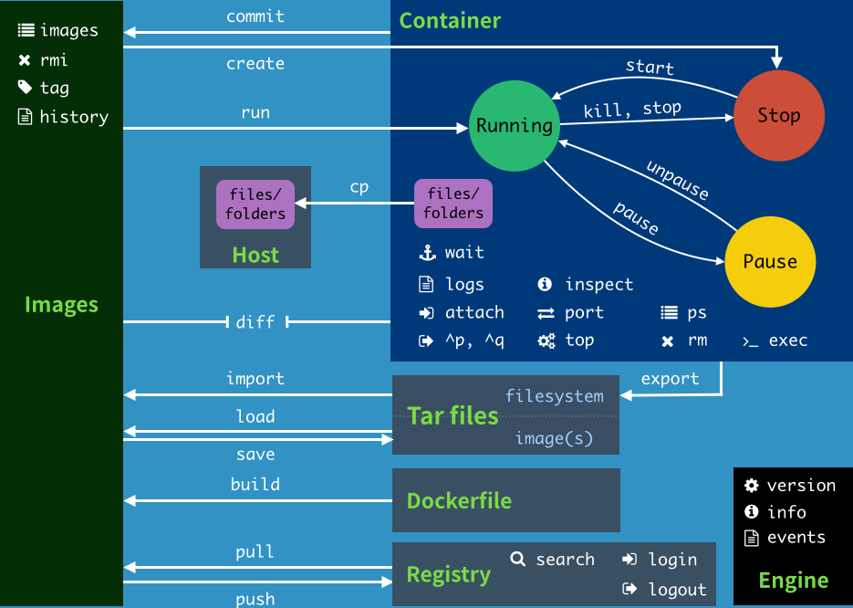

# Docker

- Docker 概述
- Docker 安装
- Docker 命令
  - 镜像命令
  - 容器命令
  - 操作命令
- Docker镜像
- 容器数据卷
- Docker File
- Docker 网络原理
- IDEA 整合Docker
- Docker Compose
- Docker Swarm
- CI/CD Jenkins


## Docker 概述

基于Go 开发

[文档地址](https://docs.docker.com/)

[Docker 仓库](https://hub.docker.com/)

### 容器化技术

容器不是一个完整的的操作系统，没有自己的内核也没有虚拟操作系统

每个容器间是互相隔离的，每个容器都有自己的文件系统

### DevOps（开发运维）

**应用更快速的交付和部署**

Docker：打包镜像发布测试，一键运行

**更快捷的升级和扩缩容**

Docker：部署应用就像搭积木

**更简单的系统运维**

Docker：开发测试环境高度一致

**更高效的计算资源利用**

Docker：内核级别的虚拟化

## Docker 安装

### Docker的基本组成


镜像（image）：模版，可以通过模版来创建容器服务，tomcat镜像==》run==》tomcat01容器

容器：Docker利用容器技术，独立运行一个或一组应用，通过镜像创建

仓库：存放镜像的地方，分公有和私有

|          概念          |                             意义                             |
| :--------------------: | :----------------------------------------------------------: |
| Docker 容器(Container) |               容器是独立运行的一个或一组应用。               |
| Docker 客户端(Client)  | 通过命令行或者其他工具使用 Docker API 与 Docker 的守护进程通信。 |
|   Docker 主机(Host)    |    一个物理或者虚拟的机器用于执行 Docker 守护进程和容器。    |
| Docker 仓库(Registry)  |  Docker 仓库用来保存镜像，可以理解为代码控制中的代码仓库。   |
|       Docker Hub       |                 提供了庞大的镜像集合供使用.                  |
|  Docker 镜像(Images)   |                 用于创建 Docker 容器的模板。                 |
|     Docker Machine     |               一个简化Docker安装的命令行工具.                |

### Docker安装

On Mac：下载Docker Desktop，按部就班安装并启动，通过如下命令测试一下 



注：阿里云可以镜像加速

### 回顾Hello World流程

docker run =》unable to find=》pull from Docker Hub=》Download=》run from local

## Docker 命令



### 帮助命令

```bash
docker version			# 版本
docker info					# 系统信息
docker 命令 --help	# 帮助
```

### 镜像命令

**docker images 查看镜像**

```bash
# lzw @ MacBook-Pro in ~ [17:14:24] 
$ docker images
REPOSITORY          TAG                 IMAGE ID            CREATED             SIZE
hello-world         latest              bf756fb1ae65        4 months ago        13.3kB
# REPOSITORY 	镜像的仓库源
# TAG					镜像的标签
# IMAGE ID		镜像ID
# CREATED			创建时间
# SIZE				镜像大小

# 可选项
  -a, --all             展示所有的镜像
  -q, --quiet           只显示ID
```

**docker search 搜索镜像**

```bash
# lzw @ MacBook-Pro in ~ [17:19:44] 
$ docker search mysql  
NAME                              DESCRIPTION                                     STARS               OFFICIAL            AUTOMATED
mysql                             MySQL is a widely used, open-source relation…   9560                [OK]                
mariadb                           MariaDB is a community-developed fork of MyS…   3472                [OK]                
mysql/mysql-server                Optimized MySQL Server Docker images. Create…   700                                     [OK]
centos/mysql-57-centos7           MySQL 5.7 SQL database server                   76                                      

# 可选项
  -f, --filter filter   比如 --filter=STARS=3000
      --format string   Pretty-print search using a Go template
      --limit int       Max number of search results (default 25)
      --no-trunc        Don't truncate output
```

**docker pull 下载镜像**

```bash
# lzw @ MacBook-Pro in ~ [17:24:48] 
$ docker pull mysql [:tag]
Using default tag: latest						# 不写tag，默认latest
latest: Pulling from library/mysql
afb6ec6fdc1c: Pull complete 				# 分层下载，docker image核心-联合文件系统
0bdc5971ba40: Pull complete 
97ae94a2c729: Pull complete 
f777521d340e: Pull complete 
1393ff7fc871: Pull complete 
a499b89994d9: Pull complete 
7ebe8eefbafe: Pull complete 
597069368ef1: Pull complete 
ce39a5501878: Pull complete 
7d545bca14bf: Pull complete 
211e5bb2ae7b: Pull complete 
5914e537c077: Pull complete 
Digest: sha256:a31a277d8d39450220c722c1302a345c84206e7fd4cdb619e7face046e89031d	# 签名
Status: Downloaded newer image for mysql:latest
docker.io/library/mysql:latest			# 真实地址
```

**docker rmi  删除镜像**

```bash
# lzw @ MacBook-Pro in ~ [17:42:02] 
$ docker rmi -f 30f937e841c8 				# docker rmi -f $(docker images -aq)
Untagged: mysql:latest
Untagged: mysql@sha256:a31a277d8d39450220c722c1302a345c84206e7fd4cdb619e7face046e89031d
Deleted: sha256:30f937e841c82981a9a6363f7f6f35ed6b9d5e3f16df50a72207e4a2a389983f
Deleted: sha256:8a5e032615340d8936e0e3707a39ce3da51dc952368176818f879e2f868b535b
Deleted: sha256:c74673a735ca31b9b5162808ab451a8b20876a15e16a7899f2101f3c9b82df60
Deleted: sha256:430365c8e22a9207dca4638c523dc82163bca3ab8a335a71147af41d1551561f
Deleted: sha256:1ede41b1dbec1a5e4385200b62283ffb25c425275530ea9e9cc36b921186cd08
Deleted: sha256:2f6badb9fd9965261d3463591f8af4afddf5f141456de83dc994690ae64b34eb
Deleted: sha256:37803884320881cd931c77dea2ee4d8a7231dfed5a02dc595e6046ffacfa6e1b
Deleted: sha256:cefc9066dc1aa84f6cddead1bb5a8c590e8368d56fb65694e8783d70791bec20
Deleted: sha256:3bfbd2dd4507386ce56fd731b3c97d10bc058e6aa478f901466da69108db50e1
Deleted: sha256:9652363dd4c1146b3f9a519800a9f379adf0b6c4f9aece1ffe965dce5f52a8ca
Deleted: sha256:0ed190016efa0f19bcc5f1d66ffffc7b09716f3c57bcc5de74a4ce217af92278
Deleted: sha256:8399fb13d72603fdc8781075672ee25fedf8384f6721639a70dd3533250ed9e4
Deleted: sha256:ffc9b21953f4cd7956cdf532a5db04ff0a2daa7475ad796f1bad58cfbaf77a07
```

### 容器命令

**docker run 运行容器**

```bash
docker pull centos
docker run [options] image

# 可选参数
		  --name													 容器名字，比如tomcat01
  -d, --detach                         后台运行
  -i, --interactive                    使用交互方式运行
  -p, --publish list                   指定容器端口 -p 8080:8080；-p 8080；8080
  -P, --publish-all                    随机端口
  -t, --tty                            伪终端或终端

# lzw @ MacBook-Pro in ~ [18:32:00] C:127
$ docker run -it centos /bin/bash
[root@1dcd379385ce /]# exit
```

**docker ps 展示容器**

```bash
# lzw @ MacBook-Pro in ~ [18:33:42] C:1
$ docker  ps        # 列出当前正在运行的容器             
CONTAINER ID        IMAGE               COMMAND             CREATED             STATUS              PORTS               NAMES

	-a 								# 当前+历史
	-n=?						  # 最近n个创建的容器
	-q								# 只显示容器编号
# lzw @ MacBook-Pro in ~ [18:34:29] 
$ docker  ps -a
CONTAINER ID        IMAGE               COMMAND             CREATED             STATUS                      PORTS               NAMES
1dcd379385ce        centos              "/bin/bash"         2 minutes ago       Exited (1) 55 seconds ago                       cool_gould
1fea76a2c802        hello-world         "/hello"            23 hours ago        Exited (0) 8 hours ago                          cranky_diffie
```

**退出容器**

```bash
exit					# 停止并退出
ctrl + P + Q 	# 不停止退出
```

**删除容器**

```bash
docker rm 容器ID
docker rm -f $(docker ps -aq)
docker ps -aq | xargs docker rm 
```

**启动容器**

```bash
docker start 容器ID						# 启动
docker restart 容器ID					# 重启
docker stop 容器ID						# 停止
docker kill 容器ID						# 强制停止
```

### 其他命令

```bash
docker run -d centos
docker ps # 发现停止了
# 后台运行必须要有前台进程，如果没有应用就会自动停止
```

**docker logs 日志**

```bash
docker logs -f -t --tail 10 44e1866d3137

# 可选参数
      --details        Show extra details provided to logs
  -f, --follow         Follow log output
      --since string   Show logs since timestamp (e.g.
                       2013-01-02T13:23:37) or relative (e.g. 42m for 42
                       minutes)
      --tail string    Number of lines to show from the end of the logs
                       (default "all")
  -t, --timestamps     Show timestamps
      --until string   Show logs before a timestamp (e.g.
                       2013-01-02T13:23:37) or relative (e.g. 42m for 42
                       minutes)
```

**docker top 查看进程**

```bash
# lzw @ MacBook-Pro in ~ [19:22:30] 
$ docker top $(docker ps -q)
PID                 USER                TIME                COMMAND
2778                root                0:00                /bin/sh -c while true;do echo hello;sleep 1;done
2836                root                0:00                {sleep} /usr/bin/coreutils --coreutils-prog-shebang=sleep /usr/bin/sleep 1	
```

**docker inspect 查看元数据**

```bash
# lzw @ MacBook-Pro in ~ [19:40:34] 
$ docker inspect 11165               
[
    {
        "Id": "11165be7144692023160ad8ec35b802a973382c70a4abebb15ca3da145018cc1",
        "Created": "2020-05-29T11:22:25.642075215Z",
        "Path": "/bin/sh",
        "Args": [
            "-c",
            "while true;do echo hello;sleep 1;done"
        ],
        "State": {
            "Status": "running",
            "Running": true,
            "Paused": false,
            "Restarting": false,
            "OOMKilled": false,
            "Dead": false,
            "Pid": 2778,
            "ExitCode": 0,
            "Error": "",
            "StartedAt": "2020-05-29T11:22:25.910941367Z",
            "FinishedAt": "0001-01-01T00:00:00Z"
        },
        "Image": "sha256:470671670cac686c7cf0081e0b37da2e9f4f768ddc5f6a26102ccd1c6954c1ee",
        "ResolvConfPath": "/var/lib/docker/containers/11165be7144692023160ad8ec35b802a973382c70a4abebb15ca3da145018cc1/resolv.conf",
        "HostnamePath": "/var/lib/docker/containers/11165be7144692023160ad8ec35b802a973382c70a4abebb15ca3da145018cc1/hostname",
        "HostsPath": "/var/lib/docker/containers/11165be7144692023160ad8ec35b802a973382c70a4abebb15ca3da145018cc1/hosts",
        "LogPath": "/var/lib/docker/containers/11165be7144692023160ad8ec35b802a973382c70a4abebb15ca3da145018cc1/11165be7144692023160ad8ec35b802a973382c70a4abebb15ca3da145018cc1-json.log",
        "Name": "/dreamy_buck",
        "RestartCount": 0,
        "Driver": "overlay2",
        "Platform": "linux",
        "MountLabel": "",
        "ProcessLabel": "",
        "AppArmorProfile": "",
        "ExecIDs": null,
        "HostConfig": {
            "Binds": null,
            "ContainerIDFile": "",
            "LogConfig": {
                "Type": "json-file",
                "Config": {}
            },
            "NetworkMode": "default",
            "PortBindings": {},
            "RestartPolicy": {
                "Name": "no",
                "MaximumRetryCount": 0
            },
            "AutoRemove": false,
            "VolumeDriver": "",
            "VolumesFrom": null,
            "CapAdd": null,
            "CapDrop": null,
            "Capabilities": null,
            "Dns": [],
            "DnsOptions": [],
            "DnsSearch": [],
            "ExtraHosts": null,
            "GroupAdd": null,
            "IpcMode": "private",
            "Cgroup": "",
            "Links": null,
            "OomScoreAdj": 0,
            "PidMode": "",
            "Privileged": false,
            "PublishAllPorts": false,
            "ReadonlyRootfs": false,
            "SecurityOpt": null,
            "UTSMode": "",
            "UsernsMode": "",
            "ShmSize": 67108864,
            "Runtime": "runc",
            "ConsoleSize": [
                0,
                0
            ],
            "Isolation": "",
            "CpuShares": 0,
            "Memory": 0,
            "NanoCpus": 0,
            "CgroupParent": "",
            "BlkioWeight": 0,
            "BlkioWeightDevice": [],
            "BlkioDeviceReadBps": null,
            "BlkioDeviceWriteBps": null,
            "BlkioDeviceReadIOps": null,
            "BlkioDeviceWriteIOps": null,
            "CpuPeriod": 0,
            "CpuQuota": 0,
            "CpuRealtimePeriod": 0,
            "CpuRealtimeRuntime": 0,
            "CpusetCpus": "",
            "CpusetMems": "",
            "Devices": [],
            "DeviceCgroupRules": null,
            "DeviceRequests": null,
            "KernelMemory": 0,
            "KernelMemoryTCP": 0,
            "MemoryReservation": 0,
            "MemorySwap": 0,
            "MemorySwappiness": null,
            "OomKillDisable": false,
            "PidsLimit": null,
            "Ulimits": null,
            "CpuCount": 0,
            "CpuPercent": 0,
            "IOMaximumIOps": 0,
            "IOMaximumBandwidth": 0,
            "MaskedPaths": [
                "/proc/asound",
                "/proc/acpi",
                "/proc/kcore",
                "/proc/keys",
                "/proc/latency_stats",
                "/proc/timer_list",
                "/proc/timer_stats",
                "/proc/sched_debug",
                "/proc/scsi",
                "/sys/firmware"
            ],
            "ReadonlyPaths": [
                "/proc/bus",
                "/proc/fs",
                "/proc/irq",
                "/proc/sys",
                "/proc/sysrq-trigger"
            ]
        },
        "GraphDriver": {
            "Data": {
                "LowerDir": "/var/lib/docker/overlay2/f2fd15615b7ce9d7635287a1f5bae75ec578253f94155a80453bd620acd0b46a-init/diff:/var/lib/docker/overlay2/da4f86bf0f2e00f420ab6fde60568875aeb817e352c80f2fb07326d4ca374a3a/diff",
                "MergedDir": "/var/lib/docker/overlay2/f2fd15615b7ce9d7635287a1f5bae75ec578253f94155a80453bd620acd0b46a/merged",
                "UpperDir": "/var/lib/docker/overlay2/f2fd15615b7ce9d7635287a1f5bae75ec578253f94155a80453bd620acd0b46a/diff",
                "WorkDir": "/var/lib/docker/overlay2/f2fd15615b7ce9d7635287a1f5bae75ec578253f94155a80453bd620acd0b46a/work"
            },
            "Name": "overlay2"
        },
        "Mounts": [],
        "Config": {
            "Hostname": "11165be71446",
            "Domainname": "",
            "User": "",
            "AttachStdin": false,
            "AttachStdout": false,
            "AttachStderr": false,
            "Tty": false,
            "OpenStdin": false,
            "StdinOnce": false,
            "Env": [
                "PATH=/usr/local/sbin:/usr/local/bin:/usr/sbin:/usr/bin:/sbin:/bin"
            ],
            "Cmd": [
                "/bin/sh",
                "-c",
                "while true;do echo hello;sleep 1;done"
            ],
            "Image": "centos",
            "Volumes": null,
            "WorkingDir": "",
            "Entrypoint": null,
            "OnBuild": null,
            "Labels": {
                "org.label-schema.build-date": "20200114",
                "org.label-schema.license": "GPLv2",
                "org.label-schema.name": "CentOS Base Image",
                "org.label-schema.schema-version": "1.0",
                "org.label-schema.vendor": "CentOS",
                "org.opencontainers.image.created": "2020-01-14 00:00:00-08:00",
                "org.opencontainers.image.licenses": "GPL-2.0-only",
                "org.opencontainers.image.title": "CentOS Base Image",
                "org.opencontainers.image.vendor": "CentOS"
            }
        },
        "NetworkSettings": {
            "Bridge": "",
            "SandboxID": "97b068f80ab0974af8716d1c33fe0ad4cb68463701ca01aeaa1fdd1cb0a117ca",
            "HairpinMode": false,
            "LinkLocalIPv6Address": "",
            "LinkLocalIPv6PrefixLen": 0,
            "Ports": {},
            "SandboxKey": "/var/run/docker/netns/97b068f80ab0",
            "SecondaryIPAddresses": null,
            "SecondaryIPv6Addresses": null,
            "EndpointID": "63238187c84e1b9fc7e19f2942b7c74e6d4ea7e0a19caca5d72e0eb93cb29cf3",
            "Gateway": "172.17.0.1",
            "GlobalIPv6Address": "",
            "GlobalIPv6PrefixLen": 0,
            "IPAddress": "172.17.0.2",
            "IPPrefixLen": 16,
            "IPv6Gateway": "",
            "MacAddress": "02:42:ac:11:00:02",
            "Networks": {
                "bridge": {
                    "IPAMConfig": null,
                    "Links": null,
                    "Aliases": null,
                    "NetworkID": "24d39daf88f39c58fdffc25b571c209d5b53a7293215eca986a9a535d3fda260",
                    "EndpointID": "63238187c84e1b9fc7e19f2942b7c74e6d4ea7e0a19caca5d72e0eb93cb29cf3",
                    "Gateway": "172.17.0.1",
                    "IPAddress": "172.17.0.2",
                    "IPPrefixLen": 16,
                    "IPv6Gateway": "",
                    "GlobalIPv6Address": "",
                    "GlobalIPv6PrefixLen": 0,
                    "MacAddress": "02:42:ac:11:00:02",
                    "DriverOpts": null
                }
            }
        }
    }
]
```

**docker exec 进入容器**

```bash
# lzw @ MacBook-Pro in ~ [19:44:04] 
$ docker exec -it 11165 /bin/bash
[root@11165be71446 /]# ls

# lzw @ MacBook-Pro in ~ [19:46:01] 
$ docker attach 11165 
hello

# docker exec				# 进入新的终端
# docker attach			# 进入正在执行的终端
```

**docker cp 拷贝文件**

```bash
# lzw @ MacBook-Pro in ~ [20:02:23] C:1
$ docker cp 11165be71446:/test.java ~/ 

# 未来使用 -v 卷
```

## 底层原理

### Docker如何工作

Docker使用c/s架构，Docker的守护进程在服务器上运行，客户端使用远程API通过Socker来创建和管理Docker容器.

**Docker 为什么比VM快**

- Docker有比虚拟机更少的抽象层
- Docker利用宿主机内核，vm需要Guest OS